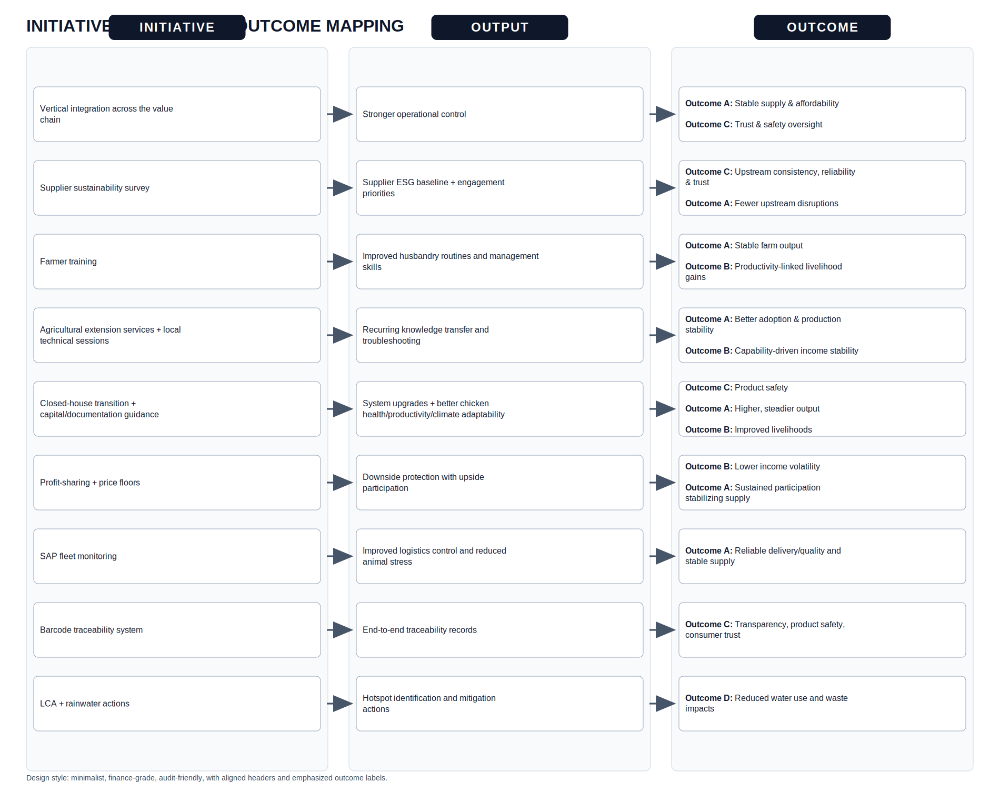

# Initiative → Output → Outcome 映射图（成品）

## 三列表格版（用于报告正文）

| initiative | output | outcome |
|---|---|---|
| Vertical integration across the value chain | Stronger operational control | Outcome A: More stable supply and affordability; Outcome C: Better oversight supporting trust and safety |
| Supplier sustainability survey | Supplier ESG baseline + engagement priorities | Outcome C: Improved upstream consistency, product reliability and trust; Outcome A: Fewer upstream disruptions |
| Farmer training | Improved husbandry routines and management skills | Outcome A: More stable farm output; Outcome B: Productivity-linked livelihood gains |
| Agricultural extension services + local technical sessions | Recurring knowledge transfer and troubleshooting | Outcome A: Better adoption and production stability; Outcome B: Capabilities supporting income stability |
| Closed-house transition + capital/documentation guidance | More farmers upgraded systems; improved chicken health, productivity, climate adaptability | Outcome C: Product safety; Outcome A: Higher, steadier output; Outcome B: Improved livelihoods |
| Profit-sharing + price floors | Downside protection with upside participation | Outcome B: Lower income volatility; Outcome A: Sustained farmer participation stabilizing supply |
| SAP fleet monitoring | Improved logistics control and reduced animal stress | Outcome A: More reliable delivery and quality, stable supply |
| Barcode traceability system | End-to-end traceability records | Outcome C: Higher transparency and product safety, stronger consumer trust |
| LCA + rainwater actions | Hotspot identification and mitigation actions | Outcome D: Reduced water use and waste impacts |
